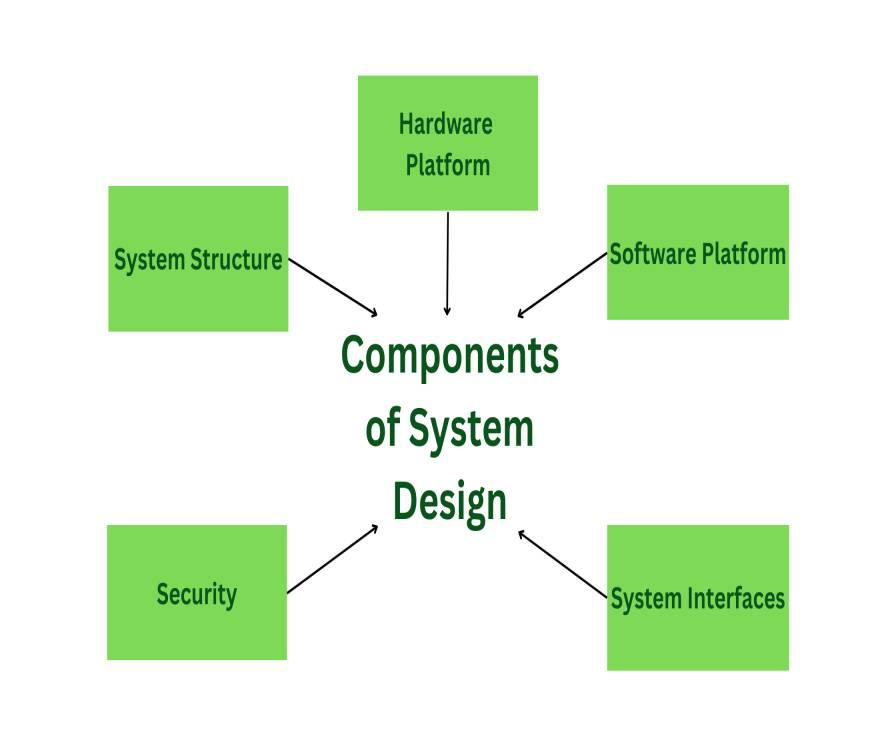

# The Clean Architecture

## 1. Architecture of a System 

### 1.1. What is Architecture of a System?
Architecture is Critical aspect of designing a system. It is responsible for how system will response, work and build. Architecture is process of high level decision making like selection of software (frameworks, tools, languages) and hardware (computers, servers).

### 1.2 Components to Consider when designing the architecture of system
To design good system architecture, need to consider all requirements and constraints of the system. Main goal is to think about long term maintainability, flexibility and scalability. If design is loosely coupled then provides more flexibility.

## 2. Clean Architecture

### 2.1 What is Clean Architecture?
Clean Architecture is introduced by Robert C. Martin (Uncle Bob). Goal of Clean Architecture is to create system that easy to undestand, maintain and flexible for future requirements. It orgnizes software componet in layers, which make it decoupled and independent of frameworks, databases and user interfaces.